# Asphalt Concrete Thermal Stress Calculation Software

**Author:** Benjamin J. Mailhé

**Version:** Beta-release (21/12/2021)

## General Presentation

The present software sums up previous developments realized on *Jupyter* into a GUI (Graphical User Interface) developed with the [DearPyGui](https://github.com/hoffstadt/DearPyGui) library. Its goal is to calculate thermal stresses that originate within an asphalt concrete slab due to thermal fluctuations of the environment. 

In this *pre-release* version, the slab thermal profile is calculated using a complex model, which includes the effect of **[Gui2007]**:
- radiation : incoming solar energy and outcoming infrared radiation (albedo);
- convection : heat exchanges with air, taking into account wind velocity and the occurrence of turbulence (if needed);
- conduction : heat transfer into the ground (semi-infinite solid).

Such model allows the obtention of a really accurate thermal profile. Indeed, obtained results are extremely close to reality, thanks to the implementation of the different physical phenomena accounting for heat exchanges between the asphalt and its surroundings **[Gui2007]**. This results in a better approximation of thermal stresses generated through the asphalt concrete slab than the one previously obtained with a simplified thermal model ($`\beta`$-version). However, two drawbacks can be noted: 
- first, the higher number of environmental input needed;  
- second, the need of an iterative scheme to solve the recurring equations of the model, requiring then a longer time to compute a solution.

## Documentation & Tutorial

The different steps necessary to obtain the asphalt concrete slab stress profile are described in the following, alongside the needed mathematical equations and scientific background employed.

### Thermal Model - Inputs

In order to properly run the physical thermal model, various inputs are needed. This way, the user is asked to fill an Excel :tm: table (*weather.xlsx*) with weather data, with measurement points ranging between 1 and 3 days. Each days has to be filled in a separated tab of the file. The required data are:
- the measured time stamp [h];
- the atmospheric temperature [ºC];
- the dew point temperature [ºF];
- the solar irradiance [W/m²];
- the wind velocity [mph].

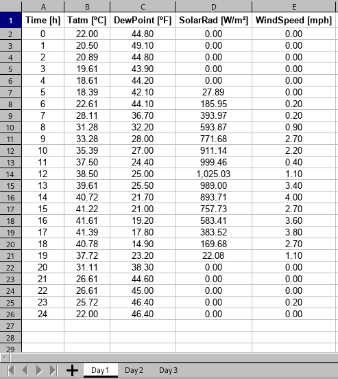

The user can verify the importation process directly within the software, using the dedicated interface.

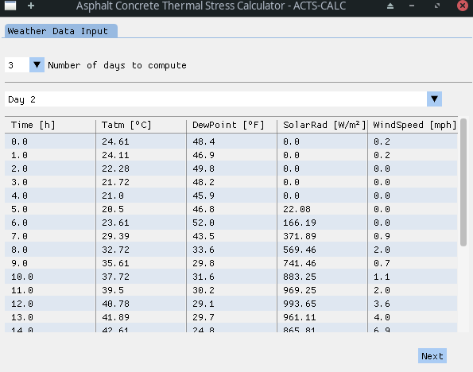

By clicking the **Next** button the user validates the importation, and a *cleaning* process is realized onto the imported weather data in order to prepare it for future use in the thermal model. Firstly, an approximation of the wind velocity data is done: a cubic polynomial fit is applied to the measured data in order to smooth it, without loosing relevant information. The results of the fitting process is shown graphically, and the obtained parameters as well as the *R²* error shown, for each day.

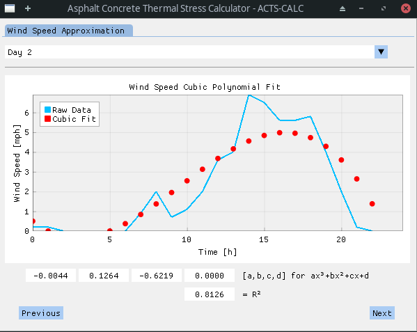

Depending on the number of days to compute (see *Figure 1*), a "stitching" can be needed between the day-by-day data. This process is automatically realized and the results shown. It is to note that, at this time, the wind speed used is the one obtained after the cubic polynomial fit.

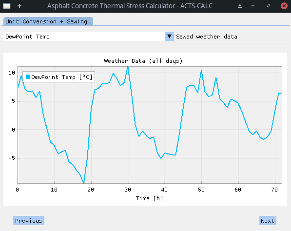

In the next step, it is required from the user to enter the *calculation parameters* to be used in order to perform the thermal profile estimation. Those are:
- the discrete time-step [s];
- the discrete spatial-step [m];
- the number of layers in the model [2-5] - There are at least two layers, the HMA (*Hot Mix Asphalt*) layer and the ground layer. However, the user can chose to include 3 more layers between those two, to take into account old-HMA layers or other relevant soil information. The drop-down menu allowing the selection automatically updates the next windows, thus allowing the user to input material data for the number of layers chosen;
- the surface material and characteristic properties, including:
    - surface albedo [0-1];
    - surface emissivity [0-1];
    - sky view-factor [0-1];
    - solar view-factor [0-1];
    - characteristic length (for convection modelling) [m].
- the deep-ground properties, namely:
    - deep-ground temperature [ºC];
    - maximum ground depth [m].

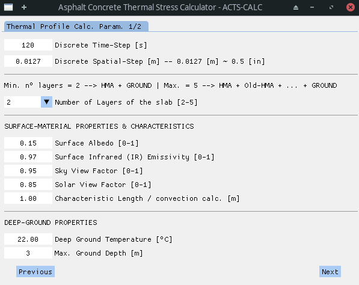

As referred to earlier, depending on the number of layers defined in the former screen, a dynamic table is produced in order to input layer properties. This table is thus of 2 to 5 columns, from the shallowest (surface) layer to the deepest (ground) one.

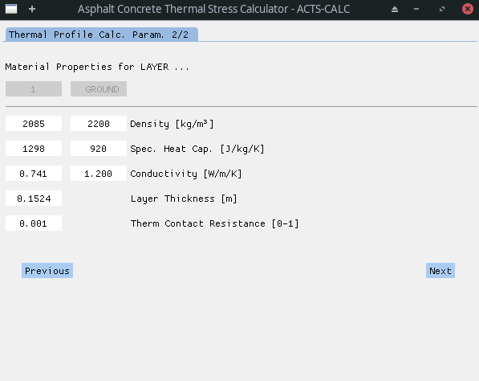

For all layers, the following properties are needed:
- density [kg/m³];
- specific heat capacity [J/kg/K];
- thermal conductivity [W/m/K].

For non-ground layers, two more properties need to be entered:
- the layer thickness [m];
- the thermal contact resistance between this layer and the adjacent one [0-1].

In the figure above, the thermal contact resistance corresponds then at the resistance between *layer 1* and *ground layer*.

### Thermal Model - Calculation Process & Results

Once validated the model parameters and material properties, the calculation starts. As will be explained in the following, the physical model is solved using a *Forward-Time Centered-Space Finite Difference* method. The system of equation used induces recurring terms: some equations use temperature results calculated at the same time-step, which themselves depend on the aforementioned equations. An iterative process is thus needed in order to solve the problem, the thermal profile converging to the definitive solution at each steps. The calculation ongoing and convergence can be visualized numerically within the program, along with some *important event* occurring during the process.

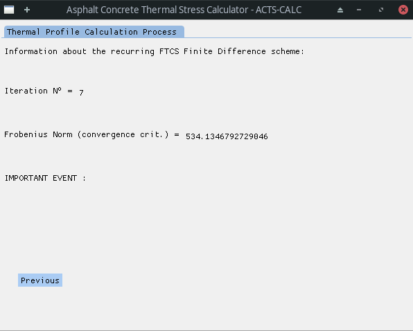

Those *important events* can refer to the following:
- the occurrence of *turbulent* flow in the calculation process;
- **#################################################**  
- **the end of the calculation without reaching the convergence criterion;**  
- **#################################################**  
- the convergence of the iterative algorithm - Information on the calculation convergence is given in the *recurring_iterations_log.xlsx* file;
- the occurrence of a numerical instability and the cancellation of the calculation - In this case, the user is asked to change the value of the time- and/or space-step, in order to ensure the CFL-criterion (see below) validation.

If the calculation went without a glitch (*convergence reached*), the user can visualize the obtained thermal profile with respect to time. Even if the calculation is realized on the whole profile, down to the *maximum ground depth*, only non-ground results are shown. This is realized in order to optimize the visualization and obtain faster graphical results. However, a *temp_profile.csv* file is available to the user, containing the full data.
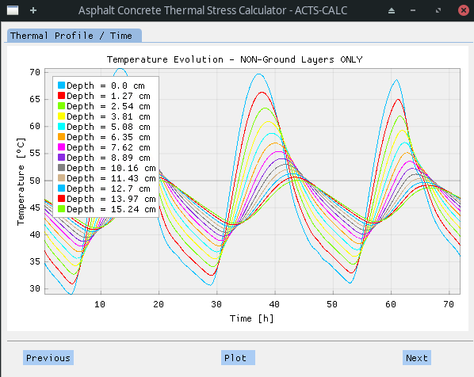

It should be noted that the library used to plot the graphs is highly dynamical, allowing to change the position of the legend, toggle on/off some curves [etc.] by entering the plot menu (*right click > settings > legend*). This way, cleaner curves can be obtained, as shown in the following figure.
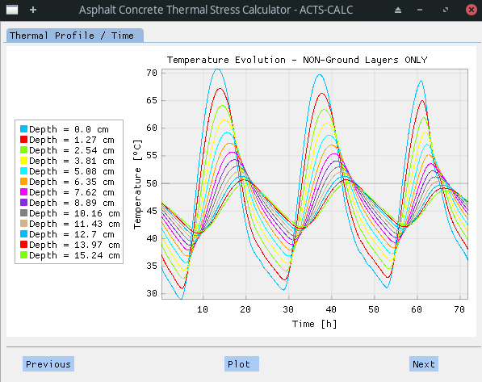

Next, the user can chose a given time-step and visualize thermal profile with respect to the pavement depth.
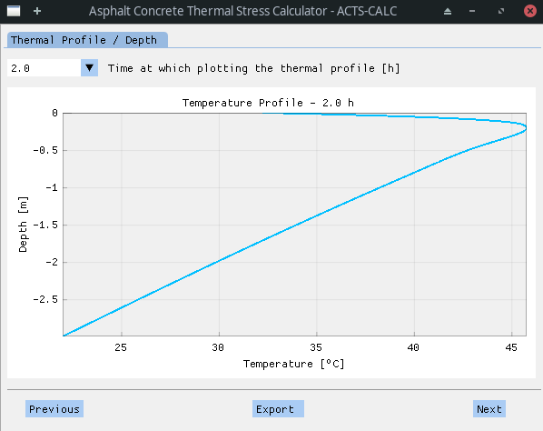

As previously, the graph can be rework (*rectangle-zoom* by clicking and sliding) to enhance the visualization quality. An export of the thermal profile to an Excel :tm: file is also possible.  
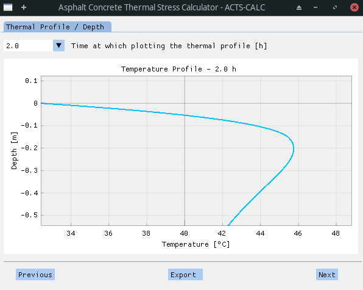

---

### Thermal Model - Mathematical & Physical Description

#### Outgoing radiation properties

In order to calculate the outgoing radiation from the surface to the horizon, a *sky temperature* needs to be compute. This is realized through equation (1).

| | |
|:--- | ---: |
|$`T_{sky}=T_{atm}\left(0.004T_{dew}+0.8\right)^{0.25}`$| (1)|

With:  
- $`T_{sky}`$ the sky temperature [K]  
- $`T_{atm}`$ the atmospheric dry-bulb temperature [K]  
- $`T_{dew}`$ the dew-point temperature [ºC]  

#### Formulae used within the recurring scheme

The following equations show recurrent terms: they depends on the surface temperature, which is calculated using the results of the aforementioned equations. Those equations are thus integrated within the recurring scheme and solved iteratively, until reaching a defined convergence criterion.

##### Outgoing radiation coefficient calculation

| | |
|:--- | ---: |
|$`h_{rad}=\Psi_{sky}\varepsilon\sigma\left(T_S^2+T_{sky}^2\right)\left(T_S+T_{sky}\right)`$| (2)|

With:  
- $`h_{rad}`$ the abbreviated parameter for outgoing radiative heat transfer coefficient []  
- $`\Psi_{sky}`$ the sky view factor []  
- $`\varepsilon`$ the infrared emissivity of the surface []  
- $`\sigma=5.67e^{-8}`$ the Stefan-Boltzmann constant [W/m²/K⁴]  
- $`T_S`$ the pavement surface temperature [K]  

##### Convection heat transfer calculation

Air film temperature **depends on SURFACE temperature**:

| | |
|:--- | ---: |
|$`T_{film}=\frac{T_{surface}+T_{atm}}{2}`$| (3)|

$`T_{film}`$ is then used together with the *Reference air film properties* to interpolated or extrapolate the **acutal** air film properties:  

- kinematic viscosity $`\nu_{film}\left(T_{film}\right)`$ [m²/s]  
- conductivity $`k_{film}\left(T_{film}\right)`$ [W/m/K]  
- diffusivity $`\alpha_{film}\left(T_{film}\right)`$ [m²/s]  
- Prandtl number $`\operatorname{Pr}\left(T_{film}\right)`$ []  

###### Reynolds number of air film

**Laminar or turbulent air flow ?**

| | |
|:--- | ---: |
|$`\operatorname{Re}=\frac{U_{film}L}{\nu_{film}}`$| (4)|

With:  
- $`\operatorname{Re}`$ the Reynolds number of air []  
- $`U_{film}`$ the wind velocity [m/s]  
- $`L`$ the characteristic length of the pavement [m]  
- $`\nu_{film}`$ the kinematic viscosity of air [m²/s]  

**If $Re<5e^5$, then the flow is laminar.  
Else it is turbulent.**

###### Nusselt number of air film in function of laminar/turbulent flow

For laminar flow:  

| | |
|:--- | ---: |
|$`\operatorname{Nu}_{laminar}=0.664\left[\operatorname{Pr}^{1/3}\operatorname{Re}^{0.5}\right]`$| (5-1)|

For turbulent flow:  

| | |
|:--- | ---: |
|$`\operatorname{Nu}_{turbulent}=0.037\left[\operatorname{Pr}^{1/3}\operatorname{Re}^{0.8}\right]`$| (5-2)|

With:  
- $`\operatorname{Nu}_{xxx}`$ the Nusselt number of air []  
- $`\operatorname{Pr}`$ the Prandtl number of air []  

###### Convective heat transfer coefficient of air hinf

For laminar flow:  

| | |
|:--- | ---: |
|$`h_{laminar}=0.664\left[k_{film}\operatorname{Pr}^{1/3}\nu_{film}^{-0.5}L^{-0.5}U_{film}^{0.5}\right]`$| (6-1)|
|$`h_{laminar}=\operatorname{Nu}_{laminar}\frac{k_{film}}{L}`$| (6-2)|

For turbulent flow:  

| | |
|:--- | ---: |
|$`h_{turbulent}=0.037\left[k_{film}\operatorname{Pr}^{1/3}\nu_{film}^{-0.8}L^{-0.2}U_{film}^{0.8}\right]`$| (6-1b)|
|$`h_{turbulent}=\operatorname{Nu}_{turbulent}\frac{k_{film}}{L}`$| (6-2b)|

With:  
- $`h_{xxx}=h_\infty`$ the convective heat transfer coefficient of air []  
- $`k_{film}`$ the thermal conductivity of air [W/m/K]  

##### Stability verification: Courant-Friedrichs-Lewy (CFL) criterion

Calculate Courant-Friedrichs-Lewy - CFL criterion at all time

| | |
|:--- | ---: |
|$`\Delta t \leq \frac{\rho_S c_S\Delta x^2}{2\left(h_{rad}\Delta x + h_\infty\Delta x + k_S\right)}`$| (7)|

With:  
- $`\rho_S`$ the density of the surface layer [kg/m³]  
- $`c_S`$ the specific heat capacity of the surface layer [J/kg/K]  
- $`k_S`$ the thermal conductivity of the surface layer [W/m/K]  
- $`\Delta t`$ the temporal discretization step [s]  
- $`\Delta x`$ the spatial discretization step [m]

##### Heat equations development using Finite Differences (FD)

A Forward-Time Central-Space Finite Difference scheme, also known as *explicit scheme*, is used to solve the general 1D diffusion equation:  

| | |
|:--- | ---: |
|$`\frac{\partial u}{\partial t}=\alpha\frac{\partial^2 u}{\partial x^2}`$| (8-1)|

With $`\alpha`$ the diffusivity [m²/s].  

This translates into the following equation:  

| | |
|:--- | ---: |
|$`\frac{u_{m}^{t+1}-u_{m}^{t}}{\Delta t}=\frac{u_{m-1}^{t}-2u_{m}^{t}+u_{m+1}^{t}}{\Delta x^2}`$| (8-2)|

Where:  
- $`m`$ represents the spacial position of the value of interest $u$  
- $`t`$ represents the temporal position of the value of interest $u$  
- $`u_{m}^{t+1}`$ is the sole unknown of the equation  

The stencil associated to the FD-FTCS scheme is shown in the next figure:  

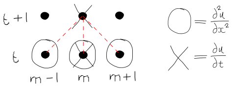

In order to take into account the different phenomena involved in the heat exchange between the pavement slab and its surroundings (environment, old asphalt layers, ground), the general 1D diffusion equation is solved in a different fashion in function of the calculation depth of interest. This can be seen in the following figure **[Gui2007]**:

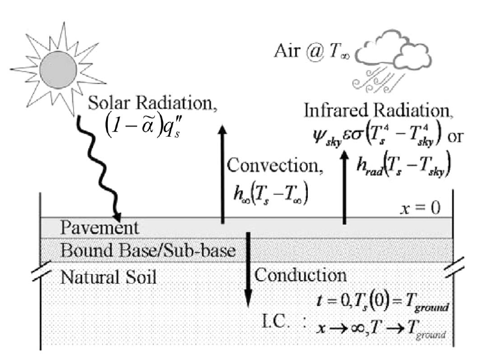

This way, at the surface (depth = 0 [m]), the equation is modified in order to take into account the input solar radiation, the output infrared radiation of the slab, the thermal convection as well as the thermal conduction. The resulting **equation (A)** can be seen below.  

On the other hand, for interior-nodes (depth > 0 [m]), only thermal conduction has to be taken into account. Thus, a simpler **equation (B)** is developed and used.  

A special case of this equation can be encountered when there is a thermal contact resistance $`R_{ij}`$ between two different layer of the ground. Such specificity is taken into account thanks to another **equation (C)** that allows taking into account the phenomenon while ensuring heat flux continuity between the $`i`$ and $`j`$ layers: 

| | |
|:--- | ---: |
|$`k_i\frac{\text{d}T_i}{\text{d}x}=k_j\frac{\text{d}T_j}{\text{d}x}`$| (9-1)|

and  

| | |
|:--- | ---: |
|$`R_{ij}=\frac{T_{i,\text{interface}}-T_{j,\text{interface}}}{q_{\text{interface}}^"}`$| (9-2)|

With:  
- $`T_{i,\text{interface}}`$ and $`T_{j,\text{interface}}`$ the interface temperatures at the ith and jth layers, respectively  
- $`q_{\text{interface}}^"`$ the heat flux flowing through the interface  

As the *true* initial thermal profile of the slab is unknown, the *Initial Boundary Condition* (BC) $`T(t=0,all\text{ }depth)=T_{ground}`$ is used.  

Additionally, the following *BC* is taken into account: $`T(all\text{ }time,\infty)=T_{ground}`$.  

Finally, it is worth noting that, due to the lack of initial thermal profile, an iterative recurring scheme scheme is needed to compute the solution. This recurrence is realized applying $T(t=0,all\text{ }depth)=T(t_{final},all\text{ }depth)$ at each iteration (except the first one, where the initial BC applies). 

A matricial *Frobenius* norm of the difference between thermal profile of iteration $i-1$ and iteration $i$ is used in order to evaluate the convergence of the recurring algorithm and define a suitable stopping criterion.  

| | |
|:--- | ---: |
|$`\mathbb{X}=\left[\text{ThProfile}\right]^{i-1}-\left[\text{ThProfile}\right]^{i}`$| (10-1)|
|$`\|\|\mathbb{X}\|\|_F=\sqrt{\sum\limits_i\sum\limits_j\|x_{ij}\|^2}`$| (10-2)|

###### Equation (A): Heat equation for surface-node S

| | |
|:--- | ---: |
|$`T_S^{t+1}=\frac{2\Delta t}{\rho_S c_S \Delta x}\left[h_\infty^{t+1}(T_{atm}^{t+1}-T_S^t)+h_{rad}^{t+1}(T_{sky}^{t+1}-T_S^t)+\Psi_{solar}(1-\bar\alpha)q_S^{"\,t+1}+k_S\frac{T_1^t-T_S^t}{\Delta x}\right]+T_S^t`$| **(A)**|

With:  
- $`T_S^{t+1}`$ the surface temperature at time $`t+1`$ [K]  
- $`\Psi_{solar}`$ the solar view factor []  
- $`\bar\alpha`$ the surface albedo []  
- $`q_S^{"\,t+1}`$ the input solar radiation flux [W/m²]  
- $`T_1^t`$ the temperature at the first discretized depth at time $`t`$ [K]  
- $`T_S^{t}`$ the surface temperature at time $`t`$ [K]  

###### Equation (B): Interior-node at depth $`m`$

| | |
|:--- | ---: |
|$`T_m^{t+1}=\frac{k_i \Delta t}{\rho_i c_i \Delta x^2}\left[T_{m-1}^t-2T_m^t+T_{m+1}^t\right]+T_m^t`$| **(B)**|

With:  
- $`T_m^{t+1}`$ the temperature at depth $m$ and time $`t+1`$ [K]  
- $`\rho_i`$ the density of layer $`i`$ [kg/m³]  
- $`c_i`$ the specific heat capacity of layer $`i`$ [J/kg/K]  
- $`k_i`$ the thermal conductivity of layer $`i`$ [W/m/K]  
- $`T_{m-1}^t`$ the temperature at depth $`m-1`$ and time $`t`$ [K]  
- $`T_{m}^t`$ the temperature at depth $`m`$ and time $`t`$ [K]  
- $`T_{m+1}^t`$ the temperature at depth $`m+1`$ and time $`t`$ [K]  

###### Equation (C): Interface-node at depth $`m=n`$

| | |
|:--- | ---: |
|$`T_{n}^{t+1}=\frac{1}{2}\left(T_{i,\text{interface}}+T_{j,\text{interface}}\right)`$| **(C-1)**|
|$`T_{n}^{t+1}=\frac{1}{2}\left[\frac{2\Delta x k_i+k_i k_j R_{ij}}{k_ik_jR_{ij}+\Delta x k_i+\Delta x k_j}\left(T_{n-1}^t\right)+\frac{2\Delta x k_j+k_i k_j R_{ij}}{k_ik_jR_{ij}+\Delta x k_i+\Delta x k_j}\left(T_{n+1}^t\right)\right]`$| **(C-2)**|

With:  
- $`T_n^{t+1}`$ the temperature at depth $`n`$ and time $`t+1`$ [K]  
- $`k_i`$ and $`k_j`$ the thermal conductivity of layer $`i`$ and $`j`$, respectively [W/m/K]  
- $`R_{ij}`$ the thermal contact resistance between layers $`i`$ and $`j`$ [0-1]  
- $`T_{n-1}^t`$ the temperature at depth $`n-1`$ and time $`t`$ [K]    
- $`T_{n+1}^t`$  the temperature at depth $`n+1`$ and time $`t`$ [K]   

###### Coefficient calculations for non-surface depths

For each ith layer, some parameters are defined.  

Those are directly related to the heat equations governing the heat energy in- and out-take, as well as it's diffusion within the slab. They are computed in order to simplify the understanding and lecture of the developed code.

Some parameters can be computed **outside** of the iterated recurring scheme, as they are fixed. This is the case for the parameters $`\delta_i`$, $`A_i`$ and $`B_i`$, associated with the interior-node heat equation **(B)**. 

| | |
|:--- | ---: |
|$`T_m^{t+1}=A_iT_m^t+B_i\left(T_{m-1}^t+T_{m+1}^t\right)`$| (11)|

With:  
- $`\delta_i=\frac{2 \Delta t}{\rho_i c_i \Delta x}`$  
- $`A_i=1-\left[\delta_i\frac{k_i}{\Delta x}\right]`$  
- $`B_i=\frac{\delta_i k_i}{2\Delta x}`$  

Identically, parameters $`C_{ij}`$ and $`D_{ij}`$, related to the interface-node equation **(C)** applied on the ith and jth layers, are computed beforehand.

| | |
|:--- | ---: |
|$`T_n^{t+1}=C_{ij}T_{n-1}^t+D_{ij}T_{n+1}^t`$| (12)|

With:  
- $`C_{ij}=\frac{1}{2}\left[\frac{2\Delta x k_i+k_i k_j R_{ij}}{k_ik_jR_{ij}+\Delta x k_i+\Delta x k_j}\right]`$  
- $`D_{ij}=\frac{1}{2}\left[\frac{2\Delta x k_j+k_i k_j R_{ij}}{k_ik_jR_{ij}+\Delta x k_i+\Delta x k_j}\right]`$  

###### Coefficient calculations for surface

In the case of the surface-node - equation **(A)** -, only 2 of the 4 parameters can be calculated outside the iterative loop: $`\delta_S`$ and $`B_S`$.  

| | |
|:--- | ---: |
|$`T_S^{t+1}=A_S^{t+1}T_S^t+B_ST_1^t+C_S^{t+1}`$| (13)|

With:  
- $`\delta_S=\frac{2\Delta t}{\rho_S c_S \Delta x}`$  
- $`A_S^{t+1}=1-\delta_S\left[h_\infty^{t+1}+h_{rad}^{t+1}+\frac{k_S}{\Delta x}\right]`$  
- $`B_S=\delta_S\frac{k_S}{\Delta x}`$  
- $`C_S^{t+1}=\delta_S\left[h_\infty^{t+1}T_{atm}^{t+1}+h_{rad}^{t+1}T_{sky}^{t+1}+\Psi_{solar}(1-\bar\alpha)q_S^{"\,t+1}\right]`$  

However, parameters $`A_S^{t+1}`$ and $`C_S^{t+1}`$ need to be included into the recurring scheme as they depends on the convective ($`h_\infty`$) and outgoing radiative ($`h_{rad}`$) coefficients, which themselves depend on the surface temperature $`T_S^t`$.  

---

### IMPORTANT POINT

The stress calculation is realized **SOLELY on the 1st layer**. Thus, only this part of the thermal profile previously calculated is taken into account in the following. This approach was chosen since it is assumed that the user will be principally interested in the stress profile of the upper layer (new-HMA) rather than in the whole pavement.

Indeed, the stress profile within the surface layer is sufficient to estimate the pavement tendency to crack. In the same time, reducing the calculation to this sole portion of the pavement allows reducing the computational burden of calculating the stress within the whole pavement (including ground), while at the same time avoiding stress-continuity mismatch at layers interface due to differing thermal contraction coefficients.

Finally, it should be noted that the time-step use in the following is 10x higher than the one employed in the thermal calculation. Indeed, if a small time-step was needed in order to ensure the stability of the *explicit scheme*, it is not the case anymore. The use of a bigger time-step thus allows a faster software responsiveness while maintaining a good accuracy.

### Coefficient of Thermal Contraction Calculation

In this part of the software, the user is given the choice bewteen 3 solutions ("*Input type*" menu):
1. The user knows the linear Coefficient of Thermal Contraction of the asphalt concrete mixture and directly enters it : $`CTC_{mix}`$ [1/K];

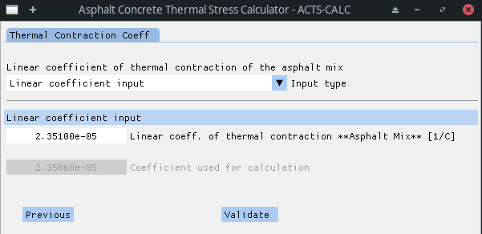

2. The user only partially knows the mixture properties. $`CTC_{mix}`$ thus needs to be computed using the following user-inputs:
    - $`CTC_{binder}`$ = Linear coefficient of thermal contraction of the binder [1/K];
    - $`CTC_{agg}`$ = Linear coefficient of thermal contraction of the aggregates [1/K];
    - $`VMA`$ = Intergranular void content in aggregates [%];
    - $`V_{agg}`$ = Aggregate volume in mixture [%].

$`CTC_{mix}`$ calculation is performed **[Lytton1993]**:

| | |
|:--- | ---: |
|$`CTC_{mix}=\frac{VMA\times CTC_{binder}+V_{agg}\times CTC_{agg}}{3\times V_{total}}`$| (14-1)|

With:

$`3\times V_{total}=3\times 100 [\%] = 300`$

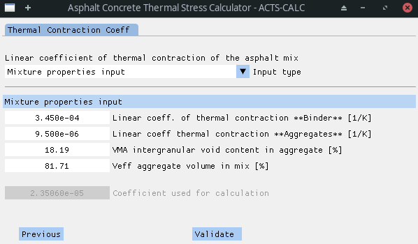

3. The user does not know any of the mixture properties. He then has to enter the following information:
    - $`CTC_{binder}`$ = Linear coefficient of thermal contraction of the binder [1/K];
    - $`CTC_{agg}`$ = Linear coefficient of thermal contraction of the aggregates [1/K];
    - $`Gsb`$ = Aggregate bulk specific gravity [-];
    - $`Gb`$ = Binder specific gravity [-];
    - $`Gmm`$ = Asphalt mixture maximum specific gravity [-];
    - $`AV`$ = Air volume [%];
    - $`BC`$ = Binder content [%].

The software automatically calculates $`VMA`$ and $`V_{agg}`$, using equations (14-4) and (14-5) respectively **[NCAT1;NCAT2]**. The results are then used in equation (14-1) to recover $`CTC_{mix}`$: 

| | |
|:--- | ---: |
|$`Gmb=\left(1-\frac{AV}{100}\right)\cdot Gmm`$ | (14-2)|
|$`Gse=\frac{100-BC}{\frac{100}{Gmm}-\frac{BC}{Gb}}`$ | (14-3|
|$`VMA=100-Gmb\cdot\frac{100-BC}{Gsb}`$ | (14-4)|
|$`V_{agg}=Gmb\cdot\left(\frac{100-BC}{Gse}\right)`$ | (14-5)|

Where:
- $`Gmb`$ = Asphalt mixture bulk specific gravity [-];
- $`Gse`$ = Aggregate effective specific gravity [-].

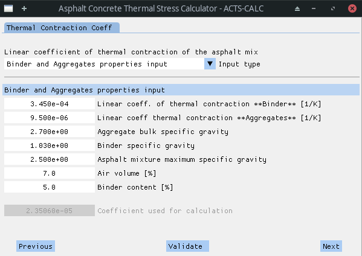

Once the user "*validates*" (see button in figures above) the chosen method, the calculation(s) is (are) realized, and the final results for $`CTC_{mix}`$ actualized and shown in the grayed out case "*Coefficient used for calculation*".

---

### Mechanical Properties

The last step before performing the stress calculation consists in entering the mechanical properties of the material, and numerically manipulating them in order to obtain the *Relaxation Modulus Master Curve* (**ErelMC**).

To do so, the user has the choice between entering the *Creep Compliance* (**CC**) data obtained experimentally at different temperatures, or to inform the *Relaxation Modulus* (**Erel**) data for various testing temps. The data is imported from Excel :tm: tables that can be found in the *DATA* directory under the name of "*creep_compliance.xlsx*" and "*relax_modulus.xlsx*", respectively. Both tables are made up of 3 columns:

1. Testing temperature [ºC];
2. Testing time [s] or frequency [Hz];
3. Mechanical property value [1/GPa] / [GPa].

Through a drop-down menu, the user can chose to read one or another of the Excel :tm: files. Depending on the chosen option, 2 different scenarii emerge.

#### Creep Compliance Properties

##### Material Input

If the user chose to enter CC measurements, the software will show the related data on the screen. This way, the user can verify that the importation process took place in a good fashion.

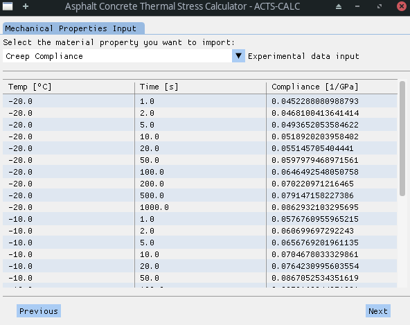

Once the user validates the data, the software will plot the raw data, and the user can chose to observe the data on a *log-log* scale. 

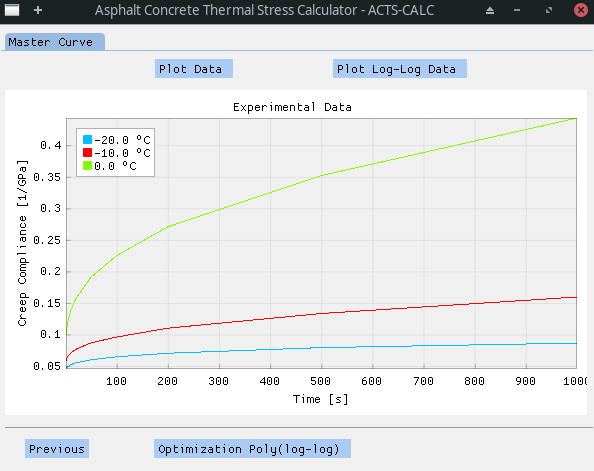

A second order polynomial function is then fitted to each *log-log* creep compliance curve (resulting in a polynome for each testing temperature). The parameters of those functions can be exported in a text file (*Export*) and found in the *RESULT* directory under the name "*polymial_optim_material.txt*".

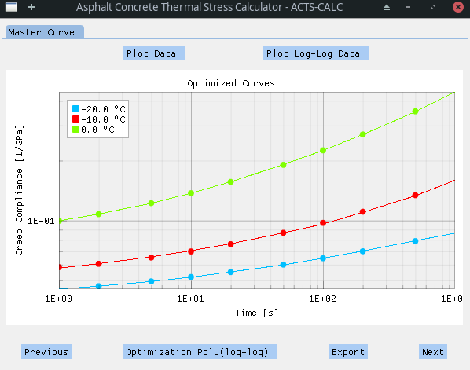

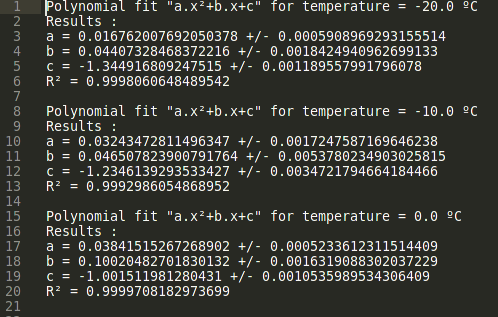

##### CCMC Construction

With this information, the *Creep Compliance Master Curve* (**CCMC**) can then be build. The Master Curve is obtained thanks to the application of the *time-temperature superposition principle* (**TTSP**) that stands for thermorheologically simple materials. In short, this principle states that the behaviour of a material at low temperature is equivalent to its response to short time (or high frequency) excitations. Conversely, the material behaviour at high temperature is assimilated to its response to long time (low frequency) excitations **[MIT]**. Thus, it is possible to calculate a shift-factor $`a_T`$ for each testing temperature, in order to estimate a *reduced time* $`\xi=\frac{t}{a_T}`$ corresponding to their equivalent long or short time excitations at a constant temperature **[Hernandez]**.

Here, the construction of the  Master Curve is realized following a technique developed by Witczak, that allows an automatic horizontal shifting of the non-reference curves **[Witczak2000]**. It consists in calculating discrete shift-factor $`\text{log}(a_T)`$ using the polynomial functions previously optimized. This process is closed to another method, called *equivalent slope*, that shows significantly better results that traditional shifting techniques **[Saboo2018]**. 

To obtain the CCMC of its material, the user just need to chose a reference temperature. Depending on this choice, results might be more or less accurate. Thus, the user is invited to test different reference temperature in order to find the most adequate.

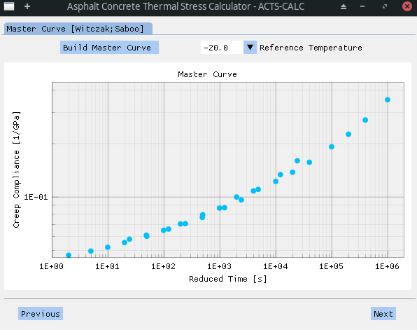

The discrete shift-factors $`\text{log}(a_T)`$ found during the construction of the master curve are accessible to the user. Those can be found under the "*RESULTS/discrete-shift.xlsx*" file.

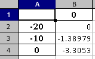

##### Continuous Shift-Factor

Once the CCMC and the associated discrete shift-factors are obtained, the user can chose between the *William-Landel-Ferry* (**WLF**) and the *Arrhenius* law to obtain a continuous evolution of the shift-factor with the temperature. The user is invited to take a close look to the obtained data, since the WLF law was initially developed in a semi-empirical fashion for plastic materials (amorphous polymers), taking into account $`\alpha`$-transitions as the main relaxation mechanism. Those transitions occur when the material is slightly above the glass transition temperature ~ [$`T_g`$;$`T_g+100ºC`$]. On the contrary, the Arrhenius law takes into account $`\beta`$-transformations, that are more common when the study temperature is well below $`T_g`$ **[MIT]**. 

| | |
|:---|---:|
|$`\text{log}(a_T)\left(T,T_{ref}\right)=-\frac{C_1(T-T_{ref})}{C_2+(T-T_{ref})}`$|(15)|
|$`\text{log}(a_T)\left(T,T_{ref}\right)=\frac{E_a}{\text{ln}(10)R}\left(\frac{1}{T}-\frac{1}{T_{ref}}\right)`$|(16)|

With:

- $`T`$ the working temperature [ºC];
- $`T_{ref}`$ the reference temperature [ºC];
- $`a_T`$ the shift-factor at temperature $`T`$ with reference temp $`T_{ref}`$;
- $`C_1`$ [-] and $`C_2`$ [K] the William-Landel-Ferry parameters;
- $`E_a`$ the material activation energy [J/mol];
- $`R`$ the ideal gas constant with $`R\approx 8.314`$ [J/(K.mol)].

Depending on the material and working temperatures, as well as on the optimization process itself - bounded *Trust Region Reflective* algorithm from [SciPy](https://www.scipy.org/); the parameters obtained when using the WLF law through equation (15) are not always optimal and can eventually lead to erroneous results. On the contrary, the sole parameters of the Arrhenius law - equation (16) - generally gives satisfying results, and stands on stronger scientific grounds, since it relies on the material chemical and physical properties.

Results obtained for the same set of discrete shift-factors with both method are shown in the following figures.

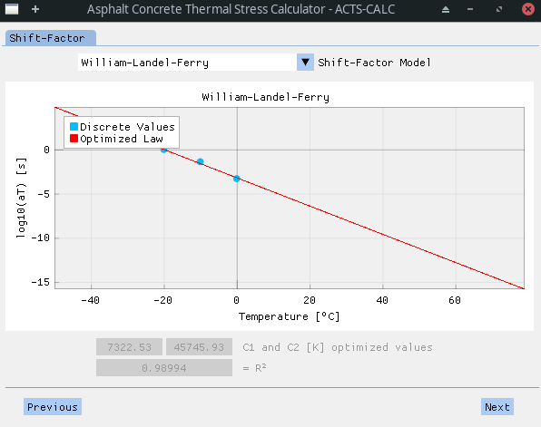

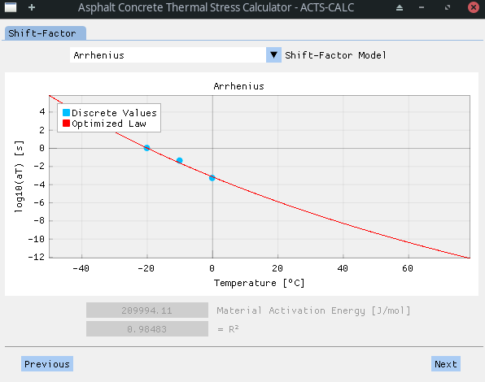

Optimized parameters for one or another of the model are accessible to the user in the *RESULTS* directory, in the Excel :tm: files named "*optim-wlf.xlsx*" or "*optim-arrhenius.xlsx*". They are also directly visible on the software screen, along with the $`R^2`$ resulting from the optimization process.

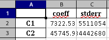

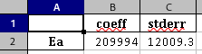

##### G-MPower Serie Optimization on CCMC

Once the shift-factor model is chosen and its parameters optimized on the discrete data, a *Generalized Modified Power Serie* (G-MPower) is used to obtain a continuous evolution of the CCMC in function of the reduced time $`\xi`$. This function is particularily suited to obtain a smooth and accurate evolution of the CCMC **[Park2001]**.

| | |
|:---|---:|
|$`D(\xi)=D_0+\sum\limits_{i=1}^N \frac{D_i}{\left(1+\frac{\tau_i}{\xi}\right)^k}`$| (17) |

With:

- $`D(\xi)`$ the creep compliance at reduced time $`\xi`$ [1/GPa];
- $`D_0`$ the *glassy* creep compliance [1/GPa] - at $`\xi\rightarrow 0^+`$;
- $`D_i`$ the local *analogous* creep compliance values [1/GPa];
- $`\tau_i`$ the local *analogous*  relaxation time [s];
- $`k`$ the power-law factor.

The user is able to chose the number of "branches" of the Power Serie, and to directly visualize the results of the optimization for the selection.

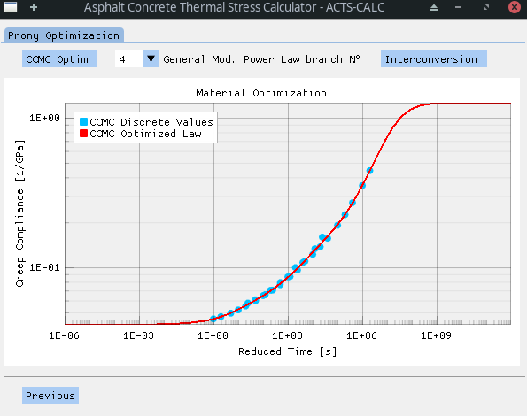

The optimized parameters can, once again, be found in the "*RESULTS/optim-GenModPower_CCMC.xlsx*" file.

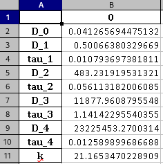

##### CCMC Interconversion to ErelMC

In order to calculate the thermal stress resulting from the temperature profile previously defined, the so-called *Relaxation Modulus Master Curve* is needed. In this case, it can be obtained through a process called *interconversion*, since the relaxation modulus $`Erel`$ is the conjugate of the creep compliance **[Alavi2014;Alavi2017]**.

The CCMC being modelled with a Power Serie, it is not possible to use an analytical development of the interconversion process, as shown in **[Park1999]**. Thus, a general *discretized* approach of the interconversion is implemented on the simulated points obtained in the previous step, following equations (18-20).

| | |
|:---|---:|
|$`n=\left\lvert\frac{d\text{log}F(\tau)}{d\text{log}\tau}\right\rvert`$ | (18) |
|$`\alpha=\left(\frac{\text{sin}n\pi}{n\pi}\right)^{1/n}`$| (19) |
|$`Erel(\xi)=\frac{1}{D\left(\frac{\xi}{\alpha}\right)}`$| (20) |

This process leads to the following results for the *ErelMC*.

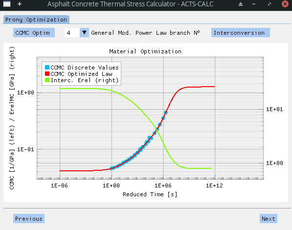

##### Prony Serie Optimization on ErelMC

Once the interconverted ErelMC is obtained, a new *Prony Serie* is optimized onto it. This time, the Prony function is adapted to a *Generalized Maxwell Model* (GMM), also known as *Wiechert Model*. The associated mechanistic scheme is shown below.

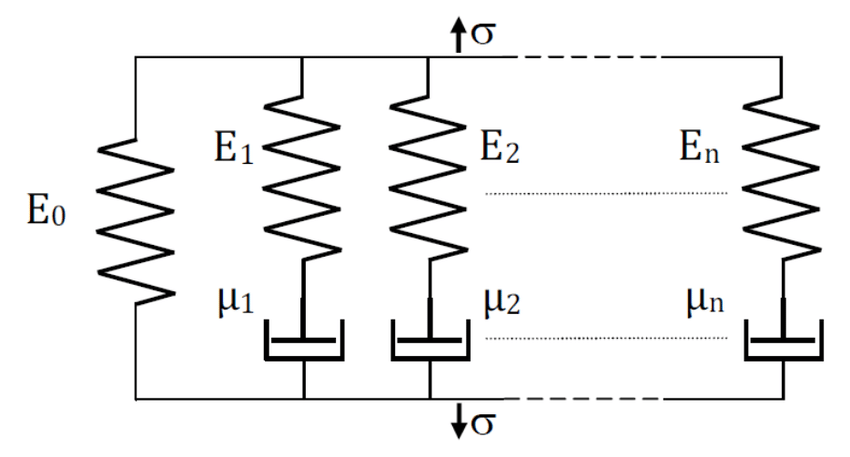

The associated equations are developed in the following - equations (21-23).

| | |
|:---|---:|
|$`Erel(\xi)=E_0+\sum\limits_{i=1}^N E_i\left(e^{-\xi/10^{\rho_i}}\right)`$| (21) |
|$`Erel(\xi)=E_0+\sum\limits_{i=1}^N E_i+\sum\limits_{i=1}^N E_i\left(e^{-\xi/10^{\rho_i}}-1\right)`$| (22) |
|$`Erel(\xi)=E_{glassy}-\sum\limits_{i=1}^N E_i\left(1-e^{-\xi/10^{\rho_i}}\right)`$| (23) |

With:

- $`Erel(\xi)`$ the relaxation modulus at reduced time $`\xi`$ [GPa];
- $`E_0`$ the *equilibrium* relaxation modulus [GPa] - at $`\xi\rightarrow +\infty`$;
- $`E_i`$ local relaxation modulus values [GPa];
- $`\rho_i=\text{log}(\tau_i)`$ the $`\text{log}`$ of the relaxation time [s];
- $`E_{glassy}`$ the *glassy* relaxation modulus [GPa] - at $`\xi\rightarrow 0^+`$.

Once more, the user is able to chose the number of "branches" of the GMM, and to directly visualize the results of the optimization for the selection.

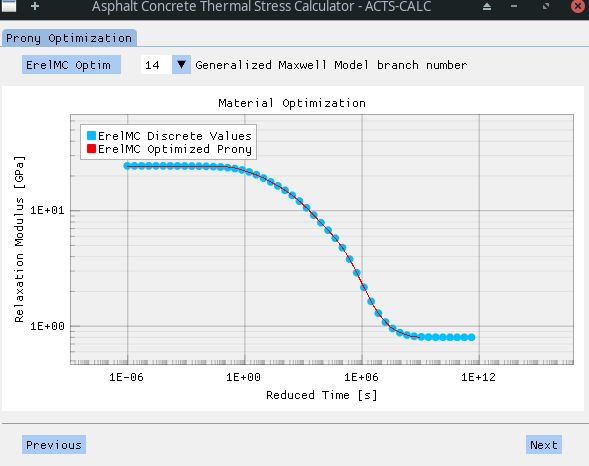

The optimized parameters can, once again, be found in the "*RESULTS/optim-prony_ErelMC.xlsx*" file.

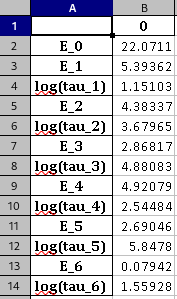

Despite the higher number of steps and the complexicity behind the "presmoothing" process, the obtained results are of greater value compared to a dual application of Prony Series, as used in version $`\alpha`$.

#### Relaxation Modulus Input

As explained earlier, the second scenario consists in directly entering the relaxation modulus data for different testing temperatures. As previously explained, after selecting the input type, the user can verify that the importation process worked as expected.

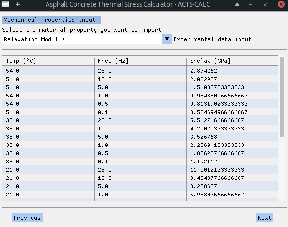

In that case, there is no need to optimize a Prony Serie on a CCMC nor to realize an interconversion process, since we can directly obtain the ErelMC. To do so, a process similar to the one presented above is employed **[Witczak2000]**. However, the polynomial functions used in that case to fit the experimental data are first order. This was decided due to the linear behaviour of the *log-log* plot.

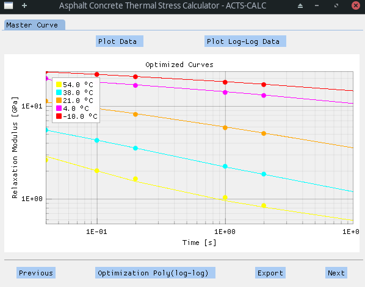

The parameters of the linear functions can be exported in a text file (*Export*) and found in the *RESULT* directory under the name "*polymial_optim_material.txt*".

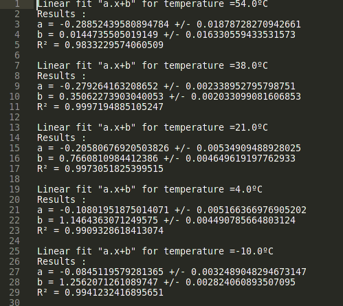

After this step, the Erel Master Curve is constructed and a shift-factor model (WLF or Arrhenius) selected.

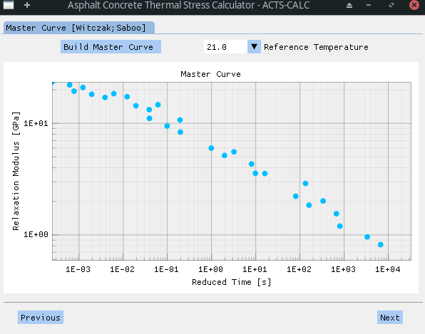

Finally, a Prony Serie is optimized onto a Generalized Maxwell Model in order to obtain a continuous evolution of the Relaxation Modulus in function of the reduced time. However, an additional smoothing process is realized using a sigmoid function (equation 24). The simulated results obtained with the optimized sigmoid curve are the one used to obtain the Prony Coefficients.

| | |
|:---|---:|
| $`\text{log}\left\lvert Erel(\xi)\right\rvert=\delta+\frac{\alpha}{1+\text{e}^{\beta+\gamma\text{log}\xi}}`$ | (24) |

With:

- $`Erel(\xi)`$ the relaxation modulus at reduced time $`\xi`$ [GPa];
- $`\alpha`$, $`\beta`$, $`\gamma`$ and $`\delta`$ are the parameters of the sigmoid law here employed.

It should be noted that a higher number of Prony branches are needed in this case to obtain a smooth behaviour at high reduced times. This leads to a higher computational ressource and time demand. However, even a small number of branches gives rise to more adequate results at small and moderate ones than the ones obtained by directly applying a Prony Serie onto the raw data, without the presmoothing process.

As always, optimized parameters are accessible to the user in the *RESULTS* directory.

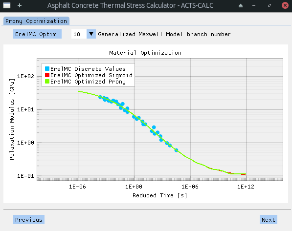

### Thermal Stress Calculation

Various techniques allow solving the ordinary differential equation (*ODE*) that arise from the Generalized Maxwell Model. In the next chapters, we will describe two of them, since both have been implemented and tested in the present software.

#### Finite Difference Method

The stress in the $`i`$-th arm of the GMM model, $`\sigma_i`$, is given by equation (25):

| | |
|:---|---:|
| $`\frac{\text{d}\sigma_i}{\text{d}t}+\frac{1}{\tau_i}\sigma_i=E_i\frac{\text{d}\varepsilon}{\text{d}t}`$ | (25) |

Where $`\varepsilon`$ is both the global and arm deformation, since $`\varepsilon_{total}=\varepsilon_i=\varepsilon`$ for the Wiechert Model.

Equation (25) can be re-writtent in backward finite difference form (implicit scheme) as:

| | |
|:---|---:|
| $`\frac{\sigma_i^t-\sigma_i^{t-1}}{\Delta t}+\frac{1}{\tau_i}\sigma_i^{t}=E_i\frac{\varepsilon^t-\varepsilon^{t-1}}{\Delta t}`$ | (26) |

Where the superscripts $`t`$ and $`t-1`$ indicate stress and deformation values before and after a small time increment $`\Delta t`$.

Starting from equation (26), it is possible to separate $`\sigma_i^t`$ and then to sum the results over all arms of the GMM and to add the stress in the equilibrium spring, following the pattern of equation (21). This leads to the following general equation (27) that can be used to calculate the stress at any time $`t`$ and for any thermal excitation, in a incremental fashion **[MIT]**.

| | |
|:---|---:|
| $`\sigma^t=E_0\varepsilon^t+\sum\limits_i\frac{E_i\left(\varepsilon^t-\varepsilon^{t-1}\right)+\sigma_j^{t-1}}{1+\left(\Delta t / \tau_i\right)}`$ | (27) |

Where, due to the TTSP, $`t=\xi`$ and $`\Delta t=\Delta\xi`$.

**#################################################**  
**NOT TRUE ANYMORE**  

**Despite the simplicity of such process and its easy numerical implementation, it could be observed a strong dependence of the results on tiny fluctations of $`E(\xi)`$. Indeed, and as shown in previous figures, the optimization of a Prony Serie on the interconverted or experimental-shifted values of *ErelMC* induces a more or less pronounce wavyness of $`E(\xi)`$, which in turn generates strong fluctuations in the calculation of $`\sigma^t`$ at certain steps.**

**To solve the problem, the time-step $`\Delta t`$ was artificially decreased to a small reasonable value using a linear interpolation scheme on the thermal profile, to ensure that equation (27) was solved in a time-stable fashion. Nevertheless, this tweak did not allow the complete correction of the observed phenomenon, as seen below.**

**#################################################**

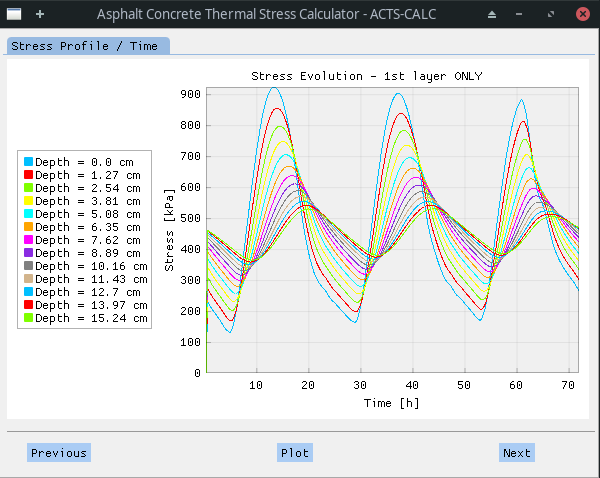

Another calculation scheme, relying on a more stable implementation, was thus implemented and tested.

#### Boltzman Superposition Integral

Starting from the GMM and equation (25), it is possible to transform the ODE into an integral equation. Indeed, integrals consist in *continuously* summing operations, and it is thus possible to express the material viscoelasticity at a given time as the continuous sum (integral) of the responses to excitations imposed at all previous times. This is why such type of integral is also known as *hereditary integral*, since the resolution of it at time $`t`$ inherits from past "experience". In the present case, the following integral equation (28) is obtained **[MIT]**:

| | |
|:---|---:|
| $`\sigma(t)=\int\limits_{0^+}^t Erel(t-\xi)\text{d}\varepsilon=\int\limits_{0^+}^t Erel(t-\xi)\frac{\text{d}\varepsilon(\xi)}{\text{d}\xi}\text{d}\xi`$ | (28) |

When facing complex excitation, as in the present case, finding a solution to this hereditary integral can be challenging, even through Fourier or Laplace integral transforms. A way to solve it is to use correspondance principles, that allow converting the stress-strain integral relationship into a simple elastic-like  (i.e. linear) stress-strain relation **[Schapery1984;Schapery1999]**. In particular, to tackle viscoelastic problems, Schapery proposed the use of so-called *pseudo-variables* **[Schapery1975a;Schapery1975b]**.

In short, the pseudo-variables method states that stresses in an elastic and viscoeslastic body are the same, and thus that it is possible to solve a viscoelastic problem using the set of equations (29-30) taking into account a Generalized Maxwell Model as stated in equation (23).

| | |
|:---|---:|
| $`\sigma=E^R\varepsilon^R`$ | (29) |
| $`\varepsilon^R=\frac{1}{E^R}\int\limits_{0^+}^t\left[E_{glassy}-\sum\limits_{i=1}^N E_i\left(1-e^{\frac{(t-\xi)}{\tau_i}}\right)\right]\frac{\text{d}\varepsilon(\xi)}{\text{d}\xi}\text{d}\xi`$ | (30) |

A numerical implementation for isotropic material proposed by Hinterhoelzl and Schapery has been employed to integrate the equation discreetly in time, through the calculation of pseudo-variables increments **[Hinterhoelzl2004]**. The calculation process is described in the paper and in **[Hözer1;Hözer2;Hözer3]**. This method showed better stability regardless of the time increment, as much as a high reliability. This technique is thus the one employed to compute all thermal stress calculations presented below.

#### Plot 1 : Stress VS Time at all depth

Once the user validates the obtained Prony Serie for $`E(\xi)`$, the stress calculation is automatically realized and the user is invited to *Plot* the results. The results are here shown **only for the 1st layer**, since the stress calculation is realized solely for this part of the pavement. 

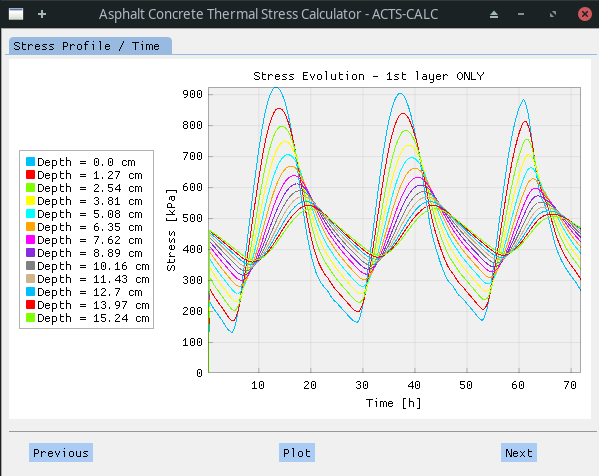

As for the thermal profile plot, the preceding one is highly interactive: the legend can be shown or hidden in few steps (*right click* on the plot); the stress evolution at a given depth can be hidden by clicking on it in the legend; figure and/or axes can be zoomed in and out etc.

As the plot is showed, the program produce an Excel :tm: table containing all the results shown in the original plot (i.e. including all depths), **with the stress values expressed in [GPa]**. In this table, the rows are related to the time step whereas the columns refer to the depth-step.

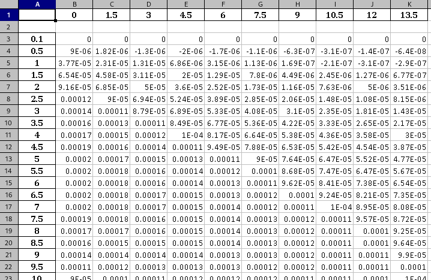

The table can be found in the *RESULTS* directory, under the name "*calculated_stress_GPa.xlsx*".

#### Plot 2 : Depth VS Temp at a given time

The "*Next*" tab allows observing the stress profile of the slab at a given time-step. To do so, the user is invited to select the time at which he desires to plot the stress profile through a drop-down menu. Once a time is selected, the plot automatically actualized, and the user is given the option to "*Export*" the data. He also can chose another time to visualize (and export). The results are here shown **only for the 1st layer**, since the stress calculation is realized solely for this part of the pavement. The depth is thus adjusted accordingly.

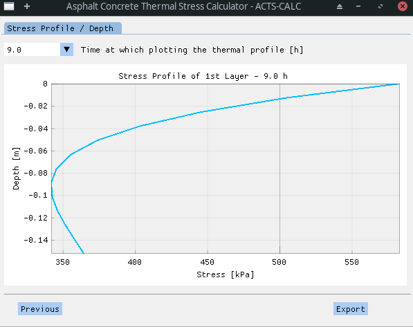

If the "*Export*" button is clicked, a new Excel :tm: file is generated by the program. In this document, the rows represent the discrete depth-step of the slab, wherease the single column is related to the time of the stress profile. Once more, **all stress values are expressed in [GPa]**.

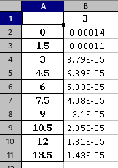

The table can be found in the *RESULTS* directory, under the name "*depthVSstress_GPa_XXh.xlsx*" (in this example: "*depthVSstress_GPa_3.0h.xlsx*").

## References

- **[Alavi2014]** : S. M. Z. Alavi, Comprehensive methodologies for analysis of thermal cracking in asphalt concrete pavements. University of Nevada, Reno, 2014.
- **[Alavi2017]** : M. Alavi, E. Y. Hajj, and P. E. Sebaaly, ‘A comprehensive model for predicting thermal cracking events in asphalt pavements’, International Journal of Pavement Engineering, vol. 18, no. 9, pp. 871–885, Sep. 2017, doi: 10.1080/10298436.2015.1066010.
- **[Gui2007]** : J. (Gavin) Gui, P. E. Phelan, K. E. Kaloush, and J. S. Golden, ‘Impact of Pavement Thermophysical Properties on Surface Temperatures’, J. Mater. Civ. Eng., vol. 19, no. 8, pp. 683–690, Aug. 2007, doi: 10.1061/(ASCE)0899-1561(2007)19:8(683).
- **[Hernandez]** : Jaime Hernandez, ‘Time-Temperature Superposition’. University of Illinois.
- **[Hinterhoelzl2004]** : R. M. Hinterhoelzl and R. A. Schapery, ‘FEM Implementation of a Three-Dimensional Viscoelastic Constitutive Model for Particulate Composites with Damage Growth’, Mechanics of Time-Dependent Materials, vol. 8, no. 1, pp. 65–94, Mar. 2004, doi: 10.1023/B:MTDM.0000027683.06097.76.
- **[Hözer1]** : H. Ozer, ‘VISCOELASTICITY MATERIAL MODEL (Based on Abaqus Viscoelasticity Documentation and Hinterhoelzl and Schapery)’. 2020.
- **[Hözer2]** : H. Ozer, ‘3-D Generalization and Pseudo Variables’. 2014.
- **[Hözer3]** : H. Ozer, ‘Part 1: Viscoelasticity L02: Integral Operators and Standard Excitations’. 2020.
- **[Lytton1993]** : R. L. Lytton, D. E. Pufahl, C. H. Michalak, H. S. Liang, and B. J. Dempsey, ‘An integrated model of the climatic effects on pavements’, no. FHWA-RD-90-033, Nov. 1993, Accessed: Oct. 02, 2021. [Online]. Available: https://trid.trb.org/view/1170101
- **[MIT]** : D. Roylance, ‘ENGINEERING VISCOELASTICITY’. Massachusetts Institute of Technology, 2001.
- **[NCAT1]** : NCAT Report 12-06, ‘A REVIEW OF AGGREGATE AND ASPHALT MIXTURE SPECIFIC GRAVITY MEASUREMENTS AND THEIR IMPACTS ON ASPHALT MIX DESIGN PROPERTIES AND MIX ACCEPTANCE’, 2009.
- **[NCAT2]** : NCAT Report 12-05, ‘EFFECT OF REJUVENATOR ON PERFORMANCE PROPERTIES OF HMA MIXTURES WITH HIGH RAP AND RAS CONTENTS’, 2012.
- **[Park1999]** : Park S. W. and Kim Y. R., ‘Interconversion between Relaxation Modulus and Creep Compliance for Viscoelastic Solids’, Journal of Materials in Civil Engineering, vol. 11, no. 1, pp. 76–82, Feb. 1999, doi: 10.1061/(ASCE)0899-1561(1999)11:1(76).
- **[Park2001]** : S. W. Park and Y. R. Kim, ‘Fitting Prony-Series Viscoelastic Models with Power-Law Presmoothing’, J. Mater. Civ. Eng., vol. 13, no. 1, pp. 26–32, Feb. 2001, doi: 10.1061/(ASCE)0899-1561(2001)13:1(26).
- **[Saboo2018]** : N. Saboo and P. Kumar, ‘Equivalent Slope Method for Construction of Master Curve’, Indian Highways, vol. 46, no. 2, Feb. 2018, Accessed: Oct. 02, 2021. [Online]. Available: https://trid.trb.org/view/1566759
- **[Schapery1975a]** : R. A. Schapery, ‘A theory of crack initiation and growth in viscoelastic media’, Int J Fract, vol. 11, no. 1, pp. 141–159, Feb. 1975, doi: 10.1007/BF00034721.
- **[Schapery1975b]** : R. A. Schapery, ‘A theory of crack initiation and growth in viscoelastic media II. Approximate methods of analysis’, Int J Fract, vol. 11, no. 3, pp. 369–388, Jun. 1975, doi: 10.1007/BF00033526.
- **[Schapery1984]** : R. A. Schapery, ‘Correspondence principles and a generalizedJ integral for large deformation and fracture analysis of viscoelastic media’, Int J Fract, vol. 25, no. 3, pp. 195–223, Jul. 1984, doi: 10.1007/BF01140837.
- **[Schapery1999]** : R. A. Schapery, ‘Nonlinear viscoelastic and viscoplastic constitutive equations with growing damage’, International Journal of Fracture, vol. 97, no. 1, pp. 33–66, Apr. 1999, doi: 10.1023/A:1018695329398.
- **[Witczak2000]**: C. Olidid and D. Hein, ‘Guide for the Mechanistic-Empirical Design of New and Rehabilitated Pavement Structures - APPENDIX HH: FIELD CALIBRATION OF THE THERMAL CRACKING MODEL’, 2004 ANNUAL CONFERENCE AND EXHIBITION OF THE TRANSPORTATION ASSOCIATION OF CANADA - TRANSPORTATION INNOVATION - ACCELERATING THE PACE, 2004, Accessed: Oct. 02, 2021. [Online]. Available: https://trid.trb.org/view/768322
